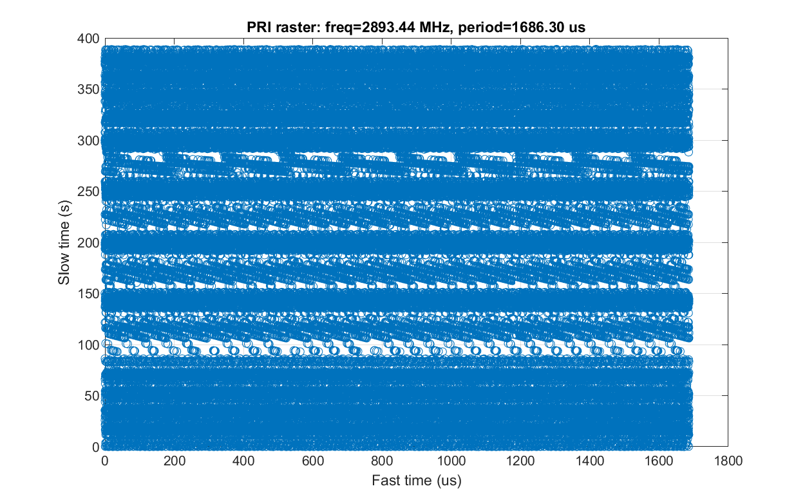
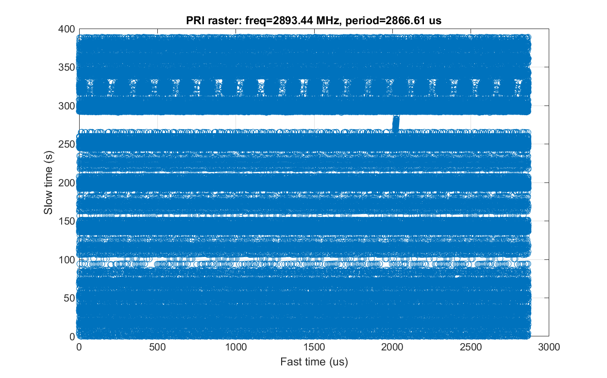

# WSR-88D: Analysis of PDWs collected with pluto_esm


## Introduction
This report presents a brief analysis of the WSR-88D radar, based on PDWs collected with the pluto_esm open-source ESM receiver. Basic radar interpulse and intrapulse parameters are examined, including the amplitude/scan pattern, pulse duration, PRI, and modulation.

## Pluto_esm
The pluto_esm platform is an open-source implementation of a narrowband, channelized ESM receiver based on the ADALM-PLUTO evaluation board combined with Python software. 

On the hardware side, the FPGA is loaded with a modified ADALM-PLUTO image, where custom ESM logic has been added. This includes a line-rate 64-channel channelizer, a multi-channel PDW encoder, a dwell controller, reporting logic, etc.

The pluto_esm_app GUI controls the operation of the hardware, providing the FPGA with a frequency hopping program according to the user-specified scan configuration. For each hop/dwell, the FPGA reports channel statistics (accumulated and maximum power) for the 64 channelizer channels, and if desired, PDWs for any detected pulses. All reports are sent via DMA to the Linux OS running on the Zynq PS layer, where a small C program fetches them from memory and forwards the data to the USB-connected Ethernet adapter.


### Pluto_esm specifications
| Parameter            | Value                      |
|----------------------|:-----------:               |
| Transceiver          | AD9363                     |
| Tuning range         | 70-6000 MHz                | 
| Instantaneous BW     | 56 MHz                     |
| FPGA                 | XC7Z010                    |
| Data link            | 100M Ethernet (emulated)   |
| Channelizer channel count   | 64                  |
| Channelizer spacing (~BW)   | 0.96 MHz            |
| Channelizer sampling freq   | 1.92 MHz            |

### Pluto_esm PDWs
PDWs are stored by pluto_esm_app in json format. An example is annotated below:
```
{"time": [2024, 12, 25, 16, 10, 39, 2, 360, 0], "sec_frac": 0.08308243751525879,    # logging timestamp
  "data": {
    "msg_seq_num": 2,               # internal message sequence number
    "msg_type": 32,                 # internal message type
    "dwell_seq_num": 0,             # dwell sequence number
    "pulse_seq_num": 1,             # per-channel pulse sequence number
    "pulse_channel": 46,            # channelizer channel index
    "pulse_threshold": 8,           # current threshold
    "pulse_power_accum": 107,       # pulse power (I^2 + Q^2) accumulator
    "pulse_duration": 3,            # pulse duration, in channelizer channel cycles (1.92 MHz)
    "pulse_frequency": 0,           # currently unused
    "pulse_start_time": 376756312,  # pulse TOA, in system clock cycles (245.76 MHz, 4x the ADC sampling frequency)
    "buffered_frame_index": 1,      # internal IQ capture index
    "buffered_frame_valid": 1,      # IQ capture valid flag
    "buffered_frame_data": [[0, -1], [-1, 0],   # raw IQ data of the pulse: 8 samples before the trigger point, up to 40 samples after
    "channel_frequency": 2893.44,   # channelizer channel frequency
    "dwell_channel_entry": {        # channel statistics (spectrum analyzer)
      "index": 46,                    # channelizer channel index
      "accum": 22969,                 # channel power accumulator (I^2 + Q^2) for the current dwell
      "max": 139                      # channel power max value for the current dwell
    },
    "dwell_threshold_shift": 3,     # automatic threshold control setting
    "modulation_data": null         # modulation analysis performed by pluto_esm_app using the raw IQ data - no modulation detected
  }
}
```

## Collection setup
* WSR-88D to receiver: R=45 mi, $$\epsilon$$=-1.2&deg;.
* VCP: 215
* Data was collected using a vertically-polarized broadband (700-6000 MHz) antenna.
* To improve coverage, an emitter-specific config was used after the operating frequency was found with a broadband scan.
```
{
    "sim_mode": {"enable": 0, "filename": "./log/recorded_data-20241125-174304.log"},
    "enable_recording": 1,
    "analysis_config": {
      "enable_pdw_recording": 1,
      "modulation_threshold": 0.25,
      "pulsed_emitter_search": {"expected_pulse_count": 0.1, "PW_range_scaling": [0.25, 1.25], "PRI_range_scaling": [0.75, 1.25]},
      "modulation_analysis": {"FM_threshold_residual": 0.05, "FM_threshold_r_squared": 0.5, "FM_threshold_slope": 1000, "FM_min_samples": 8}
    },
    "fast_lock_config": {"recalibration_interval": 60.0, "recalibration_pause": 2.0},
    "dwell_config": {"freq_start": 96.0, "freq_step": 48.0, "channel_step": 0.96},
    "scan_config": {
      "randomize_scan_order": 0,
      "include_freqs": [
          {"freq_range": [2890, 2895], "dwell_time": 0.200, "comment": "WSR-88D"}
      ],
      "exclude_freqs": [
      ]
    },
    "emitter_config": {
        "pulsed_emitters": [
            {"name": "WSR-88D", "freq_range": [2700, 3000], "PW_range": [1.57, 4.57], "PRI_range": [760, 3150],   "priority": 2, "threshold_dB": 9}
        ],
        "cw_emitters": [
        ]
    },
    "pluto_dma_reader_path": "../pluto_dma_reader/pluto_dma_reader",
    "pluto_credentials": {"username": "root", "password": "analog"},
    "graphics": {"fullscreen": 1, "noframe": 1}
}
```

## Collection analysis
* The `radar_analysis_ARSR_4.m` and `modulation_analysis.m` scripts are used to generate the plots and tables below.
* `analysis-20241225-161037.log` contains the collected PDWs used to generate the plots. Several other PDW logs are available in the same directory.
* MATLAB: R2023b

### Frequency
* The emitter appears in several channels, centered around 2893.44 MHz. The spillover into the nearby channels is likely unintentional, a byproduct of the non-ideal channelizer filter response in conjunction with a relatively dirty signal.


### Pulse duration
* For the center channel, the median pulse duration is 1.6 us, consistent with the lower end of the published range for the WSR-88D. 


### Scan
* A scan pattern is visible, but the period is not uniform, ranging from 17 to 34 seconds.
* The azimuth scan period is assumed to vary for different elevations. For VCP 215, the full sequence is known to take roughly six minutes.


### PRI
* The PRI behavior of the WSR-88D is relatively complex.
* In a full PRI histogram (a histogram of the TOA differences between a given pulse and multiple subsequent pulses), there is no large peak indicative of a common sum of a stagger sequence.


* With a first-level PRI histogram (TOA differences of adjacent pulses only), there are two prominent peaks and multiple smaller ones which cannot be attributed to noise or subharmonics.


* The TOA difference vs time plot exhibits PRI/mode switching, with certain PRIs appearing or vanishing over large intervals of time. To identify the specific PRI values, automatic clustering is used.


* With a 1% threshold, we have six PRIs:
```
PRI clustering, freq=2893.44:
   2: median: 1093.23  N:67683
   3: median: 1686.46  N: 2485
   4: median: 1966.67  N: 1490
   5: median: 2186.46  N: 1357
   9: median: 2866.67  N: 2828
  11: median: 3140.10  N: 9505
```

### Raster
* Because the PRI pattern changes over time, a single raster plot of the TOA is insufficient.
* 







### Modulation
* The ARSR-4 employs frequency modulation, and this is apparent in the raw IQ data provided with PDWs captured by pluto_esm.
* The two plots below show some example IQ captures (at 1336.32 MHz), for high and low SNRs.
* By computing the phase, unwrapping, diffing, and then fitting a line, the FM slope can be computed.


* The pluto_esm software attempts to detect FMOP for each PDW IQ capture that it receives, using the technique described above.
* From the summary statistics (again for 1336.32 MHz), we find a slope of roughly 20 kHz/us. This corresponds to a total excursion of roughly 1.2 MHz.
```
>> modulation_analysis
SNR > 30.0 dB:
example [1]: normr= 2520.4  r_squared=0.983  snr= 43.4  44.2 -- slope: -20161.6
example [2]: normr= 3935.3  r_squared=0.957  snr= 58.5  77.3 -- slope: -19892.0
example [3]: normr= 3070.1  r_squared=0.974  snr= 88.3  61.2 -- slope: -20111.7
example [4]: normr= 3922.7  r_squared=0.957  snr=114.5 130.0 -- slope: -19827.4
Hardware detection summary: num_pulses=1920  num_detected_FM=1920 (100.0%)  mean_r_squared=0.972 mean_slope=-20307.1 mean_residual=10699.4

SNR < 15.0 dB:
example [1]: normr= 6955.5  r_squared=0.860  snr=  3.2   3.4 -- slope: -18337.1
example [2]: normr= 8001.2  r_squared=0.802  snr=  2.4   1.4 -- slope: -17179.3
example [3]: normr= 8647.9  r_squared=0.841  snr=  2.6   8.0 -- slope: -21209.2
example [4]: normr=12752.5  r_squared=0.707  snr=  1.5   4.2 -- slope: -21109.1
Hardware detection summary: num_pulses=4106  num_detected_FM=4105 (100.0%)  mean_r_squared=0.806 mean_slope=-19975.4 mean_residual=44907.4
```
