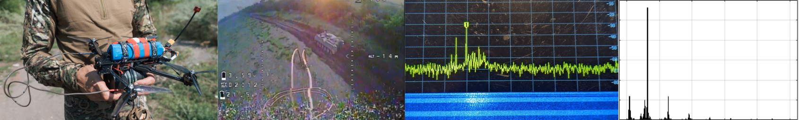
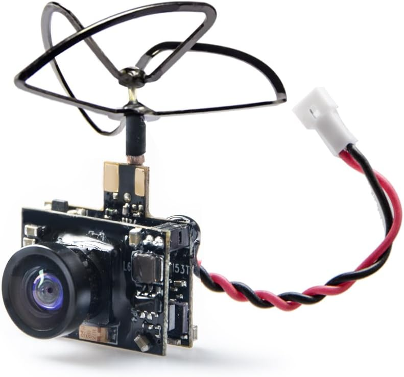
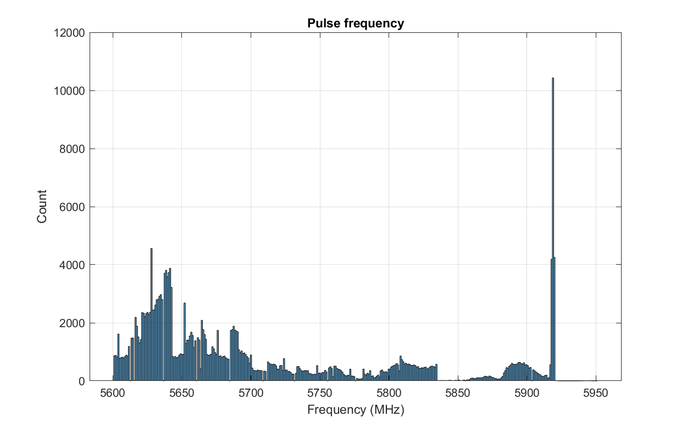
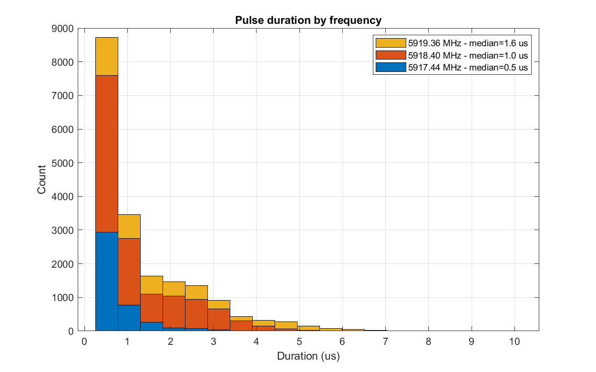
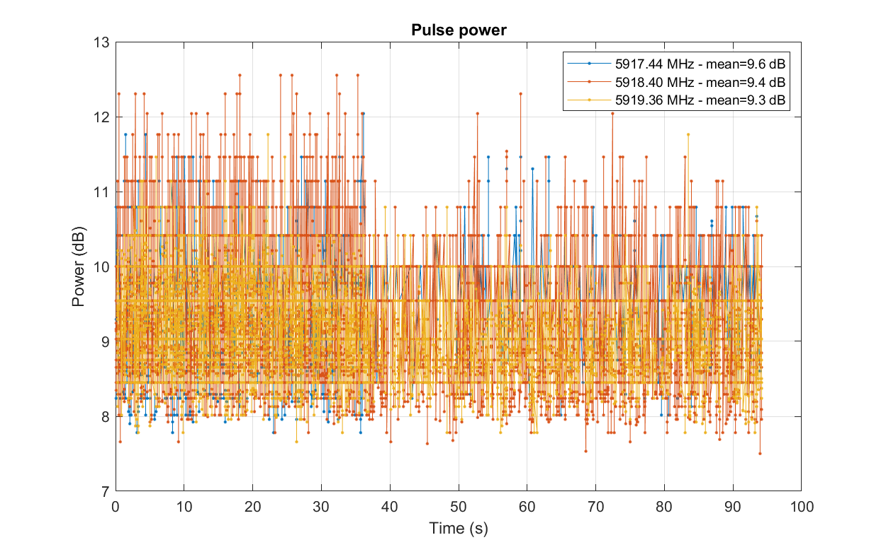
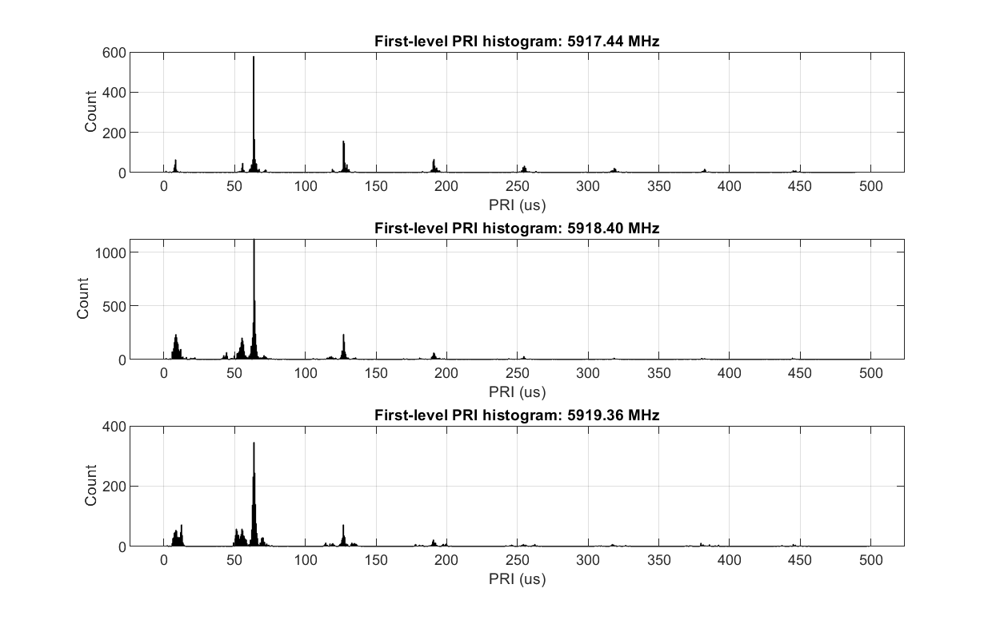
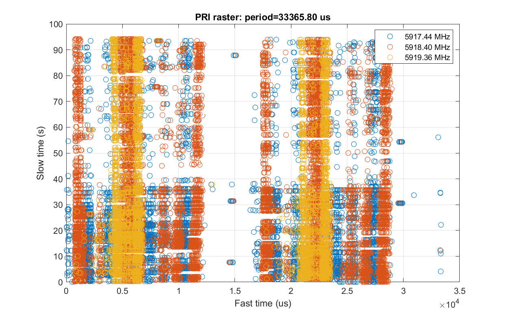
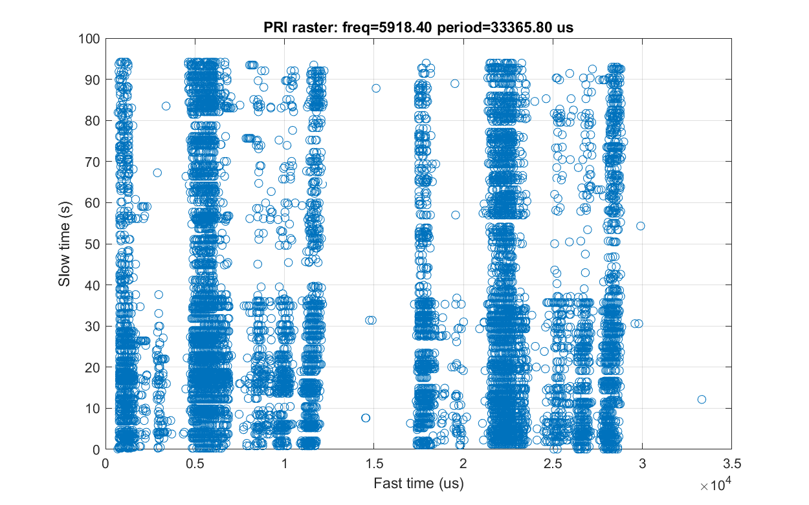
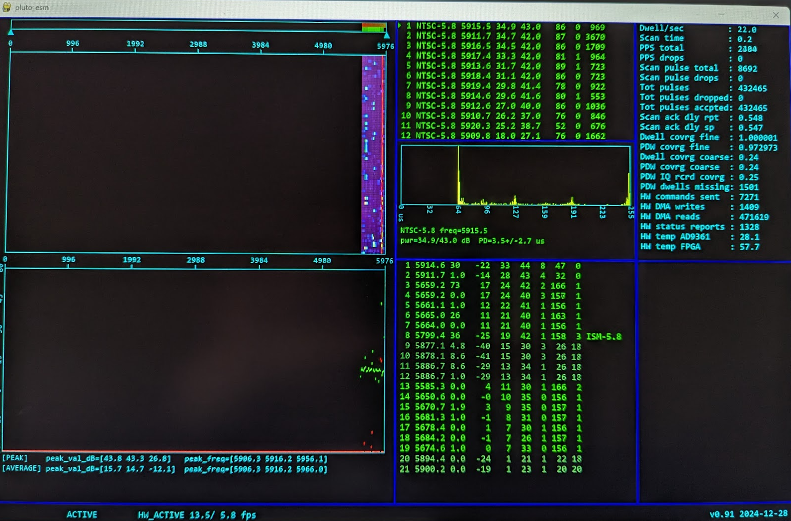
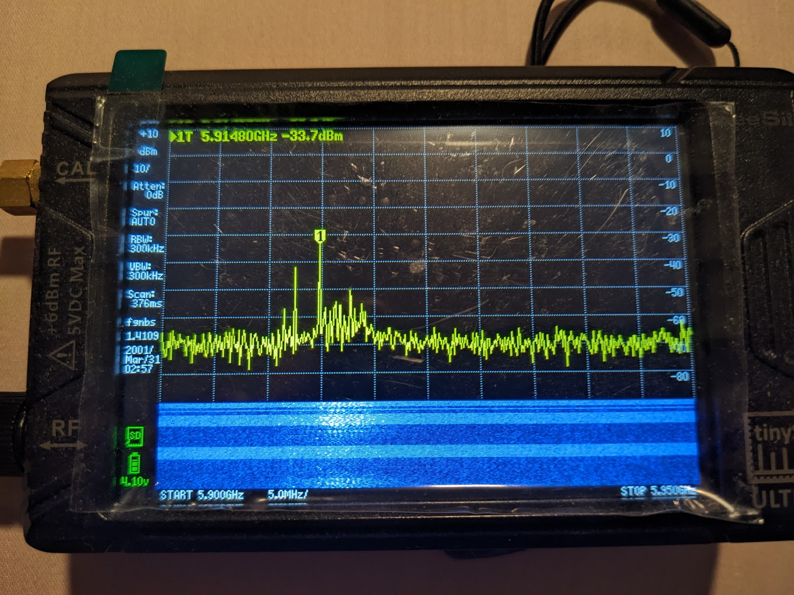

# Analog FPV drone video (NTSC): pluto_esm collection and analysis

## Introduction
This report presents a brief look at the NTSC video signal, commonly used on FPV drones, collected with the pluto_esm system (https://github.com/30N6/sw/wiki/Pluto_esm).

Although the NTSC waveform is complex and not particularly well-suited for a pulse-domain analysis (unlike, say, a radar), it does feature some periodic AM characteristics which allow a pulse-oriented ESM receiver to receive it as such. In particular, the fixed 29.97 fps frame rate together with the repeating 525 scan line/frame pattern provides a relatively stable PRI pattern among the detected pulses, and pluto_esm can effectively discriminate it in a noisy environment even with short dwells.

## Setup
* An inexpensive 5.8 GHZ FPV camera was used to generate the signal, with the power set to 20 mW.
* A number of pluto_esm configurations were tried, and it was found that even a short 10 ms dwell time setting performed well. The pulse SNR threshold for detection was set to 9 dB.
* Collection was performed indoors, with the antenna was placed 40 feet away from the transmitter in another room, in a somewhat congested RF environment.
* MATLAB R2023b for analysis
  

## Pluto_esm results
[PDW data](./data/analysis-20250118-143522-5917-20mW-10ms.log)
 
[Analysis script](./analog_video_analysis.m)

Starting with the full 5.6-5.95 GHz data, we can look at the pulse count by frequency. 

There is a large peak around 5917 MHz, the signal of interest. Large numbers of pulses from other sources appear across the band, but these aren't interesting and are excluded from further analysis (they do not preclude pluto_esm from detecting and identifying video signals). Narrowing the dataset to frequencies between 5900 and 5950 MHz, and excluding channels with fewer than 2000 pulses, there are three frequencies remaining in this data set. This is consistent with the ~6 MHz NTSC total BW and the ~1 MHz BW per pluto_esm channel.

The pulse durations are mostly very short, 1-3 IQ samples long at a channel sampling frequency of 1.92 MHz. As a result, intrapulse modulation analysis isn't a feasible way of further discriminating NTSC with pluto_esm.

Pulse power varies randomly without a discernable pattern. Note that the peak to average power ratio is generally 3-6 dB, which limits detection range.

The first-level PRI histogram (a histogram of TOA differences between adjacent pulses) exhibits clear peaks around 63 us and its harmonics, which is expected from NTSC's scan line time. In the 5.8 GHz band and elsewhere, this PRI pattern is distinctive and serves as a good means of discimination.

With the PRI plotted in raster form (horizontal axis time equal to the frame time), there are some interesting patterns across the three different frequencies, but the timing isn't very consistent (possibly due to low SNR?).

The 29.97 fps NTSC frame rate suggests further possibilities for signal discrimination, and the raster plot confirms this. Due to the high density of pulses within each scan line, however, this would be computationally expensive in software, would require longer dwells (slowing down the scan time and reducing the probability of intercept for other signals), and probably isn't necessary given the presence of the 63 us PRI.

## Spectrum analyzer/SDR comparison
Pluto_esm is not a calibrated instrument, so it is helpful to compare its performance in a relative sense to other devices that could be used for NTSC detection:
* An FPV video monitor - with a matched receiver, expected to be the best option for detecting such signals.
* A spectrum analyzer, the TinySA Ultra in this case.
* Pluto in standard SDR mode, via SDRangel.

With the FPV camera set to 20 mW and placed 40 ft away in another room, pluto_esm was able to detect and identify the NTSC signal, albeit with a low SNR. At the same time, the spectrum analyzer showed nothing, while the FPV monitor had a good image.

  

Moving the camera closer (8 ft) to the pluto_esm antenna produces an extremely high SNR and detections spilling over into additional frequency bins.  At such close range, the TinySA can discern the structure of the signal in spectrum/waterfall mode, but zero span mode remains useless (swamped with WiFi, etc).
 

 

Finally, we can look at the signal using Pluto in SDR mode, with a 10 MHz sampling frequency and a 1024-length FFT. Notably, the video signal level is below that of the DC offset of the AD9363.

For comparison, the background environment (including spurs, etc.) can be seen when the video transmitter shuts down:

## Conclusion
Although pluto_esm relies on peak power for detection (with no integration across pulses), its sensitivity appears to be better than that of a similarly-configured spectrum analyzer with this type of signal. For real-world use with any such instrument, a preamplifier would be an essential addition.
