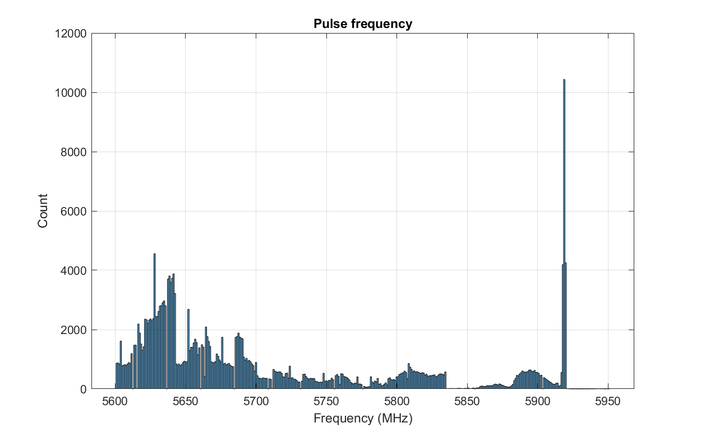
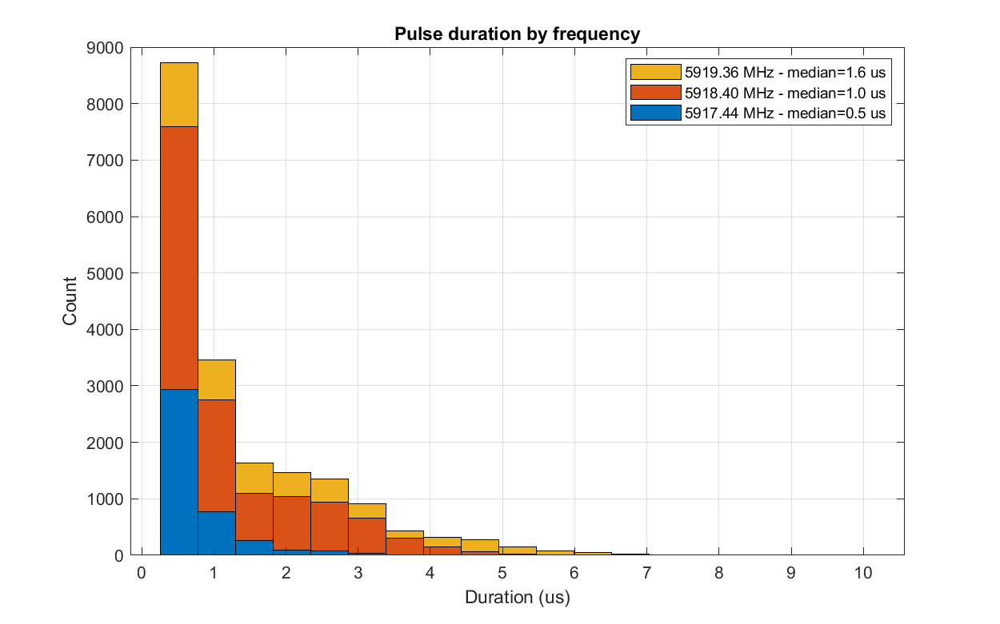
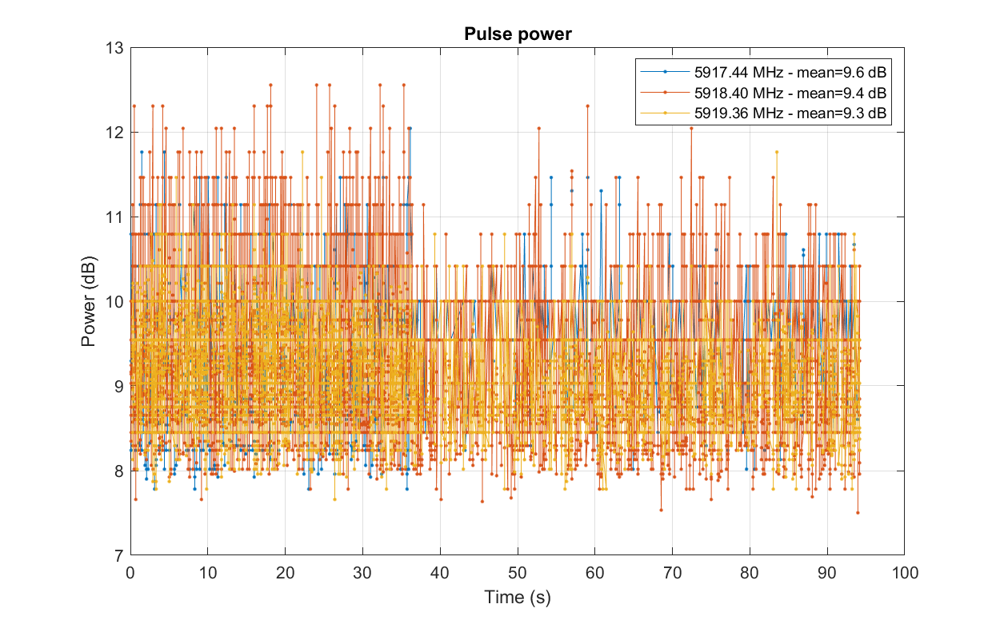
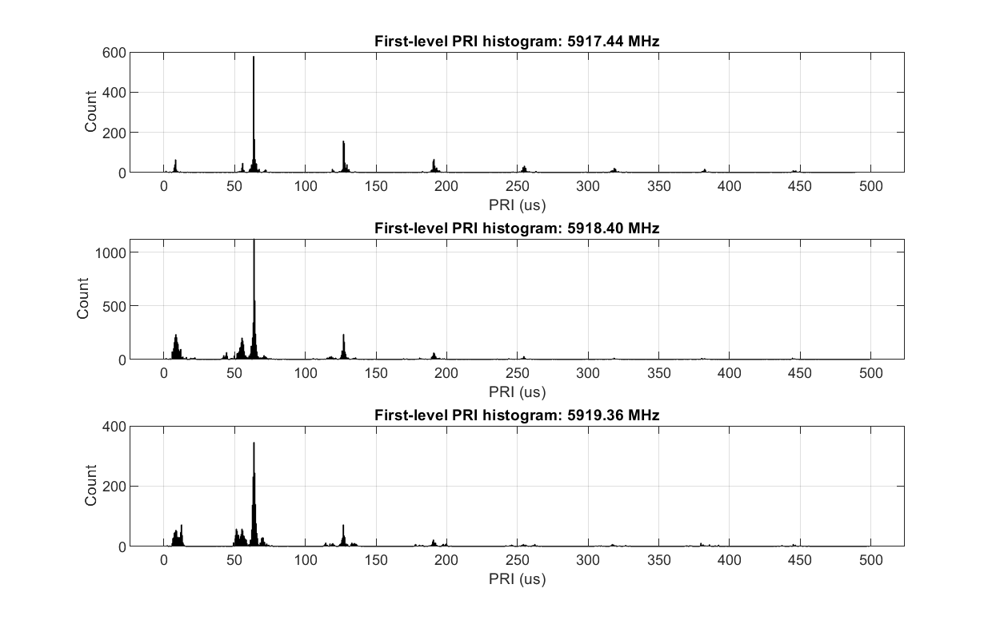
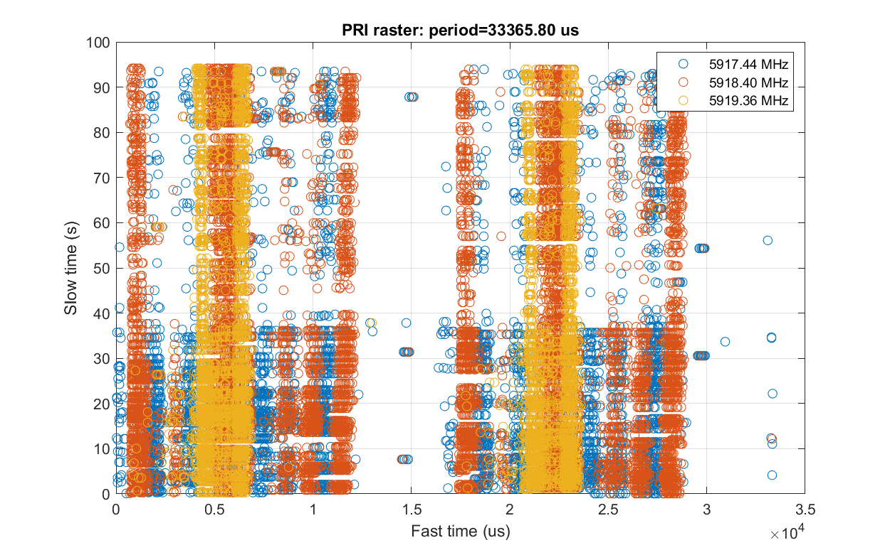
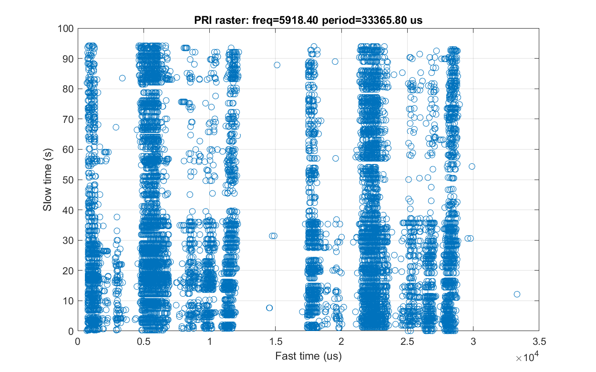

# Analog FPV drone video (NTSC): pluto_esm collection and analysis

## Introduction
This report presents a brief look at the NTSC video signal, commonly used on FPV drones, collected with the pluto_esm system (https://github.com/30N6/sw/wiki/Pluto_esm).

Although the NTSC waveform is complex and not particularly well-suited for a pulse-domain analysis (unlike, say, a radar), it does feature some periodic AM characteristics which allow a pulse-oriented ESM receiver to receive it as such. In particular, the fixed 29.97 fps frame rate together with the repeating 525 scan line/frame pattern provides a relatively stable PRI pattern among the detected pulses, and pluto_esm can effectively discriminate it in a noisy environment even with short dwells.

## Setup
* An inexpensive 5.8 GHZ FPV camera was used to generate the signal, with the power set to 20 mW.
* A number of pluto_esm configurations were tried, and it was found that even a short 10 ms dwell time setting performed well.
* Collection was performed indoors, with the antenna was placed 40 feet away from the transmitter in another room, in a somewhat congested RF environment.

## Pluto_esm results
[PDW data](./analysis-20250118-143522-5917-20mW-10ms.log)

Starting with the full 5.6-5.95 GHz data, we can look at the pulse count by frequency. 

There is a large peak around 5917 MHz, the signal of interest. Large numbers of pulses from other sources appear across the band, but these aren't interesting and are excluded from further analysis (they do not preclude pluto_esm from detecting and identifying video signals). Narrowing the dataset to frequencies between 5900 and 5950 MHz, and excluding channels with fewer than 2000 pulses, there are three frequencies remaining in this collection. 

The pulse durations are mostly very short, 1-3 IQ samples long.

Pulse power varies randomly without a discernable pattern. Note that the peak to average power ratio is generally 3-6 dB, which limits detection range.

## Spectrum analyzer comparison
* Zero span mode not helpful - swamped with WiFi

## Conclusion
Although pluto_esm relies on peak power for detection (with no integration across pulses), its sensitivity appears to be better than that of a similarly-configured spectrum analyzer with this type of signal. 

